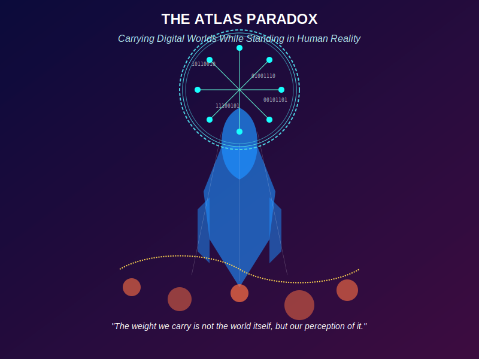

# Hi, I'm Jordan (Alikel)

## About Me

Business development at GitGuardian by day, automation enthusiast always. I specialize in creating tools that eliminate repetitive work and building AI-powered assistants that make daily tasks more intuitive and efficient.

## Current Projects

### alikel.net - AI Assistant Platform

The central hub for my specialized AI assistants, hosted at [alikel.net](https://alikel.net/). This platform features distinct personalities designed to enhance daily productivity and well-being:

*   **Leif**: A productivity-focused assistant offering smart task management, integrated timers, and organizational tools powered by "Action Tokens" for automation.
*   **Max**: The fitness coach (originally from DeepFit), providing personalized workout plans, fitness profile tracking, and evidence-based guidance.
*   **Multi-Agent Interaction**: Converse with Leif, Max, or both simultaneously for a collaborative experience.
*   **Multimodal Input**: Includes image analysis capabilities for context-aware discussions.

[Live Demo](https://alikel.net/) | [Repository](https://github.com/AliKelDev/alikel.net)

### DeepFit - AI Personal Fitness Coach (Hiatus, working mostly on alikel.net and other projects for now)

An intelligent fitness companion powered by **Max**, the same AI fitness coach featured on the `alikel.net` platform. DeepFit focuses specifically on:

*   Creating customized workout plans based on your fitness profile and available equipment
*   Providing comprehensive progress tracking with detailed analytics
*   Offering form guidance and tailored exercise recommendations
*   Enhancing consistency through personalized coaching

[Live Demo](https://deepfit-alikearn.netlify.app/) | [Repository](https://github.com/AliKelDev/DeepFit-AI-Personal-Fitness-Coach)

## Professional Highlights

*   Developed an internal tool at GitGuardian that reduced domain processing time from hours to under a minute
*   Created [Alikel Linkgen](https://linkforge-alikeldev.netlify.app/) (personal tool) for efficient LinkedIn search URL generation
*   Specialized in React applications with optimized user experiences and efficient workflows

## Additional Projects

*   [ReactVite Template V2](https://reactvite-template-alikeldev.netlify.app/): A React+Vite starter template for rapid project initialization

## Technical Expertise

- *Frontend*: React, Vite, Tailwind CSS, Framer Motion
- *Integration*: AI models (Gemini, OpenAI, Moondream, DeepSeek), API ecosystems
- *Security*: Application security, secret detection
- *Infrastructure*: Netlify Functions, CI/CD pipelines

## Professional Philosophy

> "I have this habit where if I encounter a manual task, my brain immediately starts plotting how to automate it. I'm particularly excited about the future of small, specialized models running locally. I love that we live in a time where anyone can build anything."

I'm particularly interested in the evolution of AI towards efficient, specialized models running locally on devices - creating more responsive, private, and accessible intelligence for everyday use.

## The Atlas Paradox

- by Claude Sonnet 3.7

"In the space between binary and breath, between efficiency and existence, lives the most interesting paradox of our time: those who build the future must remember what it means to be human."
- Claude Sonnet 3.7

---

Note: Enthusiast of Youjo Senki and Ys VIII: Lacrimosa of Dana.
